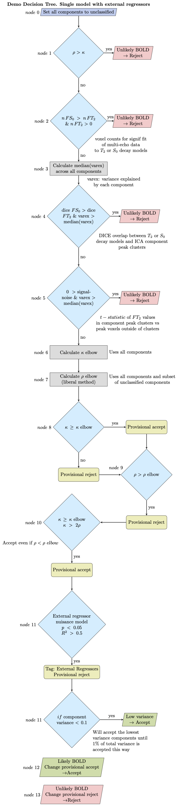
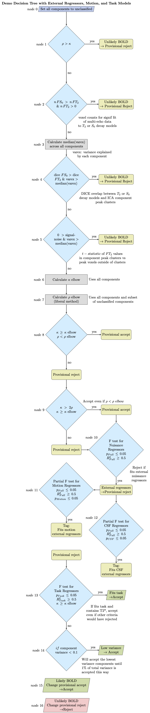

#######################
Included Decision Trees
#######################

Five decision trees are currently distributed with ``tedana``.

``meica`` is the decision tree that is based on MEICA version 2.5 and
``tedana_orig`` is very similar and has been included with ``tedana``
since the start of this project. An explanation of why these both exist
is `in the FAQ`_
While multiple publications have used and benefited from this decision,
tree, but it includes many steps with arbitrary thresholds and, when
components seem misclassified, it's often hard to understand why.

``minimal`` is a simplified version of that decision tree with fewer
steps and arbitrary thresholds. Minimal is designed to be more stable
and comprehensible, but it has not yet be extensively validated and
parts of the tree may change in response to additional tests on a
wider range of data sets.

With the addition of options to fit external regressors to components,
there are two demonstration decision trees that implement this new functionality.
While these might work well, since they have not yet been validated on data, they
are labeled ``demo``.
``decision_tree_demo_external_regressors_single_model``
demonstrates fitting all nuisance regressors to a single model.
``decision_tree_demo_external_regressors_motion_task_models``
demonstrates fitting nuisance regressors to a model,
partial tests and tagging for components that fit Motion or CSF regressors,
and retention of some components that fit task regressors.

Flowcharts describing the steps in these trees are below.
As documented more in :doc:`building_decision_trees`, the input to each tree
is a table with metrics, like :math:`\kappa` or :math:`\rho`, for each
component. Each step or node in the decision tree either calculates
new values or changes component classifications based on these metrics.
When a component classification changes to ``accept`` or ``reject``, a
``classification_tag`` is also assigned which may help understand why
a component was given a specific classification.

Each step in the flow chart is labeled with a ``node`` number.
If ``tedana`` is run using one of these trees, those node
numbers will match the numbers in the ``ICA status table`` and the
``ICA decision tree`` that are described in
:ref:`output-filename-descriptions`. These node numbers can be used
to see when in the process a component's classifiation changed.

..
    Reminder on how to load svg if I can figure out how to correctly generate them
    .. raw:: html

        

.. _in the FAQ: faq.html#tree-differences

*******************
meica decision tree
*******************

Nodes 1-5 reject components that are very unlikely to be BOLD.
In nodes 9-10 components where :math:`\kappa` >
:math:`\kappa` elbow and :math:`\rho` < :math:`\rho`
elbow are classified as `provisional accept`. A non-obvious aspect
of this decision tree is that no decision node below this point distinguishes
components that are `provisional accept` from components that are still
`unclassified` and nothing that does not cross the :math:`\kappa` and
:math:`\rho` elbow thresholds is inherantly rejected. The number of
`provisional accept` components is used to see if the process should
be restarted (node 11) and calculate other thresholds (nodes 12-16 & 20),
but nothing is directly accepted or rejected based on the elbow thresholds.
Several additional criteria are used to reject components (nodes 17, 21, & 22).
In older versions of ``tedana`` components were classified as `ignored`.
This meant too small/minor to lose a degree of freedom by rejecting so treat
like the `accepted` components. This was widely confusing to many users so they
are now classified as `accepted` but with classification tags `low variance`
(node 18) or `accept borderline` (nodes 24 & 25).

`LaTeX file to generate the meica decision tree flow chart`_

.. _LaTeX file to generate the meica decision tree flow chart: _static/decision_tree_meica.tex

***************************
tedana_orig decision tree
***************************

Identical to the meica decision tree until node 21. In the tedana tree,
components that cross the threshold criteria in nodes 21 and 22 are
rejected and not included in the calculation for a new variance explained
threshold in node 23. In the meica tree, those components are provisionally
rejected, but still included in the new variance explained calculation and
can be potentially accepted in nodes 24 and 25. This means tedana will give
the same results as meica or reject additional components base on those two
final decision criteria.

`LaTeX file to generate the tedana_orig decision tree flow chart`_

.. _LaTeX file to generate the tedana_orig decision tree flow chart: _static/decision_tree_tedana_orig.tex

*********************
Minimal decision tree
*********************

The minimal tree starts similarly to the other trees by rejecting components
that are very unlikely to be BOLD (nodes 1-5). Then all components where
:math:`\kappa` > :math:`\kappa` elbow and :math:`\rho` < :math:`\rho` elbow
are `provisional accept` and otherwise are `provisional reject` (nodes 8 & 10).
The only expection to this is if :math:`\kappa` > :math:`\kappa` elbow and
:math:`\kappa` > 2* :math:`\rho` than it is `provisional accept` regardless of the
:math:`\rho` elbow under the assumption that there is enough T2* weighted signal
the component should not be rejected even if it also contains noise (node 9).
If `provisional reject` components have very low variance they are accepted rather
than losing degrees of freedom, but no more than 1% of the total variance can be
accepted this way (node 11). After that point, everything that is
`provisional accept` is accepted (node 12) and everything that is `provisional reject`
is rejected (node 13)

.. image:: _static/decision_tree_minimal.png
    :width: 400
    :alt: Minimal Decision Tree Flow Chart

`LaTeX file to generate the minimal decision tree flow chart`_

.. _LaTeX file to generate the minimal decision tree flow chart: _static/decision_tree_minimal.tex

*********************************************
Demo external regressors single model
*********************************************

This tree is similar to the minimal tree except there is an added node (node 11)
where components are rejected if they significantly fit a model of external nuisance regressor
time series and the fit models a substantial amount of the total variance.
Unlike the minimal tree, components that would be accepted based on :math:`\kappa` & :math:`\rho`
criteria can be rejected based on a fit to external regressors.
This is called a "demo" tree because it is demonstrating how fits to external regressors can
be used. It might be a good decision tree to use,
but results have not yet been tested and validated.

****************************************************
Demo external regressors, motion task models
****************************************************

This is based on the minimal tree, but multiple nodes were added to demonstrate how to use
external regressors for fits.
Unlike the minimal tree, components that would be accepted based on :math:`\kappa` & :math:`\rho`
criteria can be rejected based on a fit to external regressors.
Components are rejected if they significantly fit a model of external nuisance regressor
time series and the fit models a substantial amount of the total variance (node 10).
For rejected components, if they also fit a partial model of motion external regressors (node 11),
or CSF external regressors (node 12), the outputs are also tagged to say they fit those groups
of regressors.
Additionally, if a rejected component fits the task design and has
:math:`\kappa` > :math:`\kappa` elbow, then it is accepted under the conservative assumption to
retain task fitting components with some :math:`T_2^*`` signal even if those components also
contain potentially rejection-worthy noise (node 13).
This is called a "demo" tree because it is demonstrating how fits to external regressors can
be used. It might be a good decision tree to use,
but results have not yet been tested and validated.

