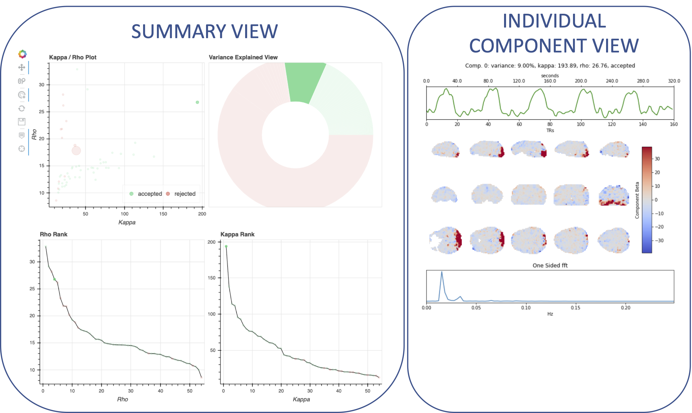

# Summary

Functional magnetic resonance imaging (fMRI) is a popular method for in vivo neuroimaging. Modern fMRI sequences are often weighted towards the blood oxygen level dependent (BOLD) signal, which is closely linked to neuronal activity [@Logothetis2002-af]. This weighting is achieved by tuning several parameters to increase the BOLD-weighted signal contrast. One such parameter is “TE,” or echo time. TE is the amount of time elapsed between when protons are excited (the MRI signal source) and measured. Although the total measured signal magnitude decays with echo time, BOLD sensitivity increases [@Silvennoinen2003-kg]. The optimal TE maximizes the BOLD signal weighting based on a number of factors, including  several MRI scanner parameters (e.g., field strength), imaged tissue composition (e.g., grey vs. white matter), and proximity to air-tissue boundaries.

Even as optimal TE values vary by brain region, most whole-brain fMRI scans are "single-echo," where signal is collected at a fixed TE everywhere in the brain. This TE value is often based on either a value that is best on average across all brain regions or an optimised value for a specific region of interest [@Stocker2006-ae; @Peters2007-lc]. Generally, these choices reflect a tradeoff between BOLD weighting, overall signal-to-noise ratio (SNR), and signal loss due to magnetic susceptibility artifacts. Further, for any TE with BOLD signal there is also susceptibility to contamination from noise sources including head motion, respiration, and cardiac pulsation [@Chang2009-bj; @Power2018-ca; @Murphy2013-vo; @Caballero-Gaudes2017-ix].

Rather than collect data at a single TE, an alternative approach is to collect multiple TEs (that is, multiple echos) for each time point. This approach, also known as multi-echo fMRI, has several benefits, including allowing researchers to estimate each voxel's T~2~^\*^ value, combining echos [@Posse1999-lt], recovering signal in regions typically not sampled at longer echo times [@Kundu2013-xm], and improving activation and connectivity mapping [@Gonzalez-Castillo2016-tj; @Caballero-Gaudes2019-lv; @Lynch2020-tz] even in real time fMRI [@Heunis2020-bd]. In addition, artifactual non-T~2~^\*^ changes (known as S~0~ in this context) may be identified and removed by leveraging the relationship between BOLD contrast and T~2~^\*^ obtained with multi-echo fMRI [@Kundu2012-bq]. Strategies to perform this efficiently and robustly are in active development.

Continuing these efforts, we present *tedana* (TE-Dependent ANAlysis) as an open-source Python package for processing and denoising multi-echo fMRI data. *tedana* implements two approaches to multi-echo preprocessing: (1) estimating a T~2~^\*^ map and using these values to generate a weighted sum of individual echos, and  (2) using echo-time dependent information in analysis and denoising [@Kundu2012-bq].

# Statement of Need

To date, multi-echo fMRI has not been widely adopted within the neuroimaging community. This is likely due to two constraints: (1) until recently, the lack of available multi-echo fMRI acquisition protocols, and (2) the lack of software for processing multi-echo fMRI data in a way that integrates with existing platforms, such as AFNI [@Cox1996-up], SPM [@Penny2011-vi], FSL [@Jenkinson2012-eh], and fMRIPrep [@Esteban2020-ul].

*tedana* helps to address these gaps both as a software tool and as a community of practice. We have tightly scoped *tedana* processing to focus on those portions of the fMRI analysis workflow which are multi-echo specific in order to maximize their compatibility with other community tools. The primary interfaces for users are (1) a ``t2smap`` workflow, which estimates voxel-wise T~2~^\*^ and S~0~ and combines data across echos to increase temporal SNR, and (2) a full ``tedana`` workflow, which performs the same steps as the ``t2smap`` workflow and additionally performs ICA-based denoising to remove components exhibiting noise-like signal decay patterns across echos [@Kundu2012-bq]. The ``tedana`` workflow additionally generates interactive HTML reports through which users may visually inspect their denoising results and evaluate each component’s classification. An example report is presented in \autoref{fig:report}.

The limited focus and modularity of each workflow allows for easy integration into existing fMRI processing platforms. Individual modules also allow researchers to flexibly perform T~2~^\*^/S~0~ estimation, combination across echos, decomposition with PCA or ICA, and component selection outside of a specific workflow call. As a community of practice, *tedana* serves as a resource for researchers looking to learn more about multi-echo fMRI, from theory to collection to analysis. To specifically increase the availability of multi-echo protocols, *tedana’s* documentation (available at https://tedana.readthedocs.io) consolidates acquisition guidelines for multi-echo sequences across a variety of field strengths and scanner vendors, as well as general recommendations for balancing relevant trade-offs in fMRI acquisition parameter choices. It further serves to consolidate community knowledge, including guides explaining the underlying principles of multi-echo fMRI and information on publicly available multi-echo datasets and general recommendations for balancing relevant trade-offs in sequence development.

Although *tedana* is still in alpha release, it has already been incorporated into fMRIPrep and is supported by AFNI. *tedana* has additionally been used in a number of publications and conference presentations [@Lynch2020-tz; @Moia2021-ti; @Moia2020-bb; @asyraff2020stimulus; @Cohen2021-ep]. We further hope that *tedana* will serve as a testing bed for new multi-echo related methods. To this end, we have developed a detailed contributing process and explicit project governance to encourage a healthy community and encourage other multi-echo research groups to contribute.

*tedana* is installable via PyPi (``pip install tedana``) and contains extensive documentation (https://tedana.readthedocs.io) to orient researchers to multi-echo fMRI acquisition and processing.

# Figures

# Acknowledgements

We would like to thank the Mozilla Open Leaders program, and the NIMH intramural research program, including the Section on Functional Imaging Methods and the Statistical and Scientific Computing Core, which have all provided funding or resources for *tedana* development.

Funding for ARL, KLB, and TS was provided by NIH R01-DA041353 and NIH U01-DA041156.
Funding for KJW was provided through The Alan Turing Institute under the EPSRC grant EP/N510129/1.

# References
